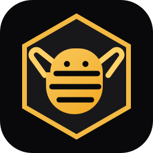

<div align="center">



# BeeCode

**The AI Coding Agent**

Small agent. Big work.

BeeCode is a terminal-native coding
assistant that works with the AI model provider you choose. It understands
your codebase, edits files, runs shell commands, searches the web, and
manages long-running tasks.

Interactively · Headlessly (scripting / CI) · Embedded via ACP

[](LICENSE)
[](rust-toolchain.toml)
[](#building-from-source)

[Quickstart](#quickstart) · [Build from source](#building-from-source) ·
[Development](#development) · [Docs](#documentation) · [Contact](#contact)

</div>

---

## Quickstart

```sh
bee --version
bee
```

`bee`, `beecode`, and `beecode-pager` are the same binary — use whichever name you prefer.

BeeCode uses the provider API key and model configured for your project. It is
provider-neutral: BeeCode is not the CLI of any specific model or AI company.
See [LLM providers](#llm-providers-no-login-required) for setup.

## Building from source

Requirements: pinned Rust toolchain (`rust-toolchain.toml`, auto-installed by
`rustup`) + [DotSlash](https://dotslash-cli.com) on `PATH` **before** building
(proto codegen via `bin/protoc` needs it; falls back to `protoc` on `PATH`).

```sh
cargo install dotslash
dotslash --help                                  # sanity check
cargo run -p beecode-pager-bin            # build + launch the TUI
cargo build -p beecode-pager-bin --release # binaries: target/release/bee, beecode, beecode-pager
```

> BeeCode supports Windows, macOS, and Linux. On Windows, install a real
> `protoc` binary and place it on `PATH` before building.

## LLM providers (no login required)

BeeCode authenticates with provider API keys — OpenAI, Anthropic, or any
OpenAI-compatible endpoint. No account login, no OAuth.

1. Create `.beecode/settings.json` in your project (the nearest one walking up
   from where you run wins).
2. Set your key: `OPENAI_API_KEY` / `ANTHROPIC_API_KEY` (or inline `api_key`,
   not recommended — never commit real keys).
3. Run: `bee -p "hello"`.

`api_backend` selects the protocol: `responses` / `chat_completions` (OpenAI),
`messages` (Anthropic). Settings merge above the BeeCode home config, below
`BEECODE_CONFIG` overlays and enterprise pins.

## Development

```sh
cargo check -p "<crate>"            # fast validation — always scope to one crate
cargo test -p beecode-config       # per-crate tests (never bare `cargo test`)
cargo clippy -p "<crate>"           # lint rules: clippy.toml
cargo fmt --all                     # format
```

> Root `Cargo.toml` is generated — edit per-crate `Cargo.toml` files only.
> Package names are `beecode-*` (no spaces, no quoting needed). See [AGENTS.md](AGENTS.md).

## Repository layout

| Path | Contents |
|------|----------|
| `crates/codegen/beecode-pager-bin/` | Composition root — builds the `bee` / `beecode` / `beecode-pager` binaries |
| `crates/codegen/beecode-pager/` | The TUI: scrollback, prompt, modals, rendering |
| `crates/codegen/beecode-shell/` | Agent runtime + headless / ACP entry points |
| `crates/codegen/beecode-tools/` | Tool implementations (terminal, edit, search, …) |
| `crates/codegen/beecode-workspace/` | Filesystem, VCS, execution, checkpoints |
| `crates/common/`, `crates/build/`, `prod/mc/` | Shared leaf crates |
| `third_party/` | Vendored upstream sources (don't refactor) |

## Documentation

Full user guide ships in-crate:
[`crates/codegen/beecode-pager/docs/user-guide/`](crates/codegen/beecode-pager/docs/user-guide/)
— setup, shortcuts, slash commands, config, theming, MCP, skills, plugins,
hooks, headless mode, sandboxing.

## Contact

Maintained by **Mohamed El Haddioui**.

[](https://www.linkedin.com/in/mohamed-el-haddioui-ba8ba8170/)
[](https://mohamedelhaddioui.netlify.app/)
[](mailto:mohamedelhaddioui99@gmail.com)

## License

Apache-2.0 — see [LICENSE](LICENSE). Third-party attributions:
[THIRD-PARTY-NOTICES](THIRD-PARTY-NOTICES). Security reports:
[SECURITY.md](SECURITY.md) (HackerOne, never public issues).
